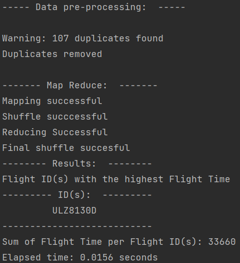

# Map Reduce using Threads - without Hadoop

The objective of this project is to implement a MapReduce solution which is implemented 
in parallel without the use of Hadoop to determine the passenger(s) 
from a provided dataset, with the highest number of flights.

This project was implemented using an OOP approach to encourage re-usability in similar tasks
___
### Walkthrough
This program;
* Receives a path to a CSV file
* Reads the data and performs some preprocessing steps
* Maps each word(default is passenger ID) to a number/count (default is count) -> `mapper`
* Appends all the numbers/counts for each ID into a list and sets the list as a value to the ID(key) -> `sort`
* Sums up the numbers/counts for each ID -> `reducer`
* Displays the passengers with the highest number of trips based on how many times their ID appeared in the data.
___
### File description
* `config.yaml` - configure this file to change the outputs.
  * path: Path to csv file containing data.
  * header: If the csv file has headers or not.
  * pattern: The program makes sure words match a particular pattern.
  * column_index: Provide the column indices to be used.
  * sum_column: The column to be summed by the Reducer.
  * column1_search: The string/word to be searched for in the data.
  * column2_search: The definition of column to be summed by reducer.
  * The [config file](config.yaml) has detailed comments for better understanding


* `src/simple.py` - This script compares performance of threading and 
multiprocessing for this task with a simplified solution.
  * To run, enter this code in the src folder: `python simple.py`
  * Output:

    

  
* `src/main.py` - Following the experiment performed above, the main script was developed using threads.
This script performs MapReduce on a specified dataset using
threads and displays the passenger(s) with the highest count (default is passengers with the most trips)
  * Output:
  
    
  * By modifying `config.yaml` file alone, I configured the program to search and display Flight ID(s) with the most 
  Flight Time from another dataset.
    * Output:
  
    

* `src/MapReduce.py`: This script contains the MapReduce implementation.
* `src/testMapReduce.py`: This script contains unit tests for the MapReduce implementation.
  * To run the tests, run this code in scrips folder: `python testMapReduce.py`
___
### Dependencies
* **Python3**: This program uses the `concurrent.futures` module, which isn't available 
in lower versions of Python, e.g., python 2.7.

* This program requires only 2 external libraries - `pandas` and `yaml`.

* The versions of the external libraries used in development have been 
put in a `requirement.txt` file. Run the following command to install:
```
pip install -r requirements.txt
```
Alternatively, you can install the two libraries mentioned above separately using the following commands:

```
pip install pandas
pip install pyyaml
```
___
## How to run
Execute following command in preferred directory:
```
git clone <https link to repo>

cd map-reduce-using-threads-without-hadoop/src/

python main.py
```

---
## License
[License](LICENSE)